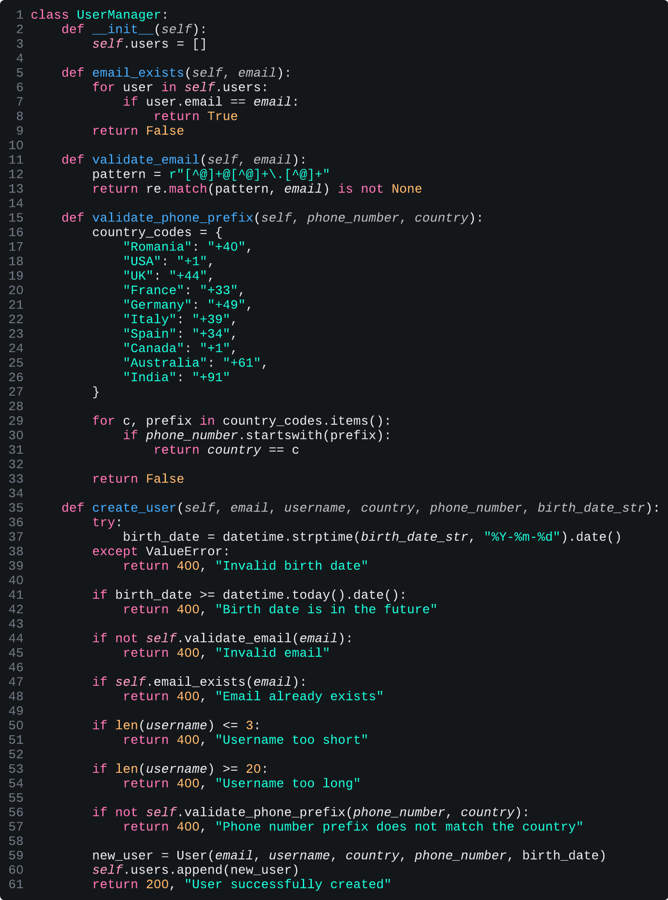
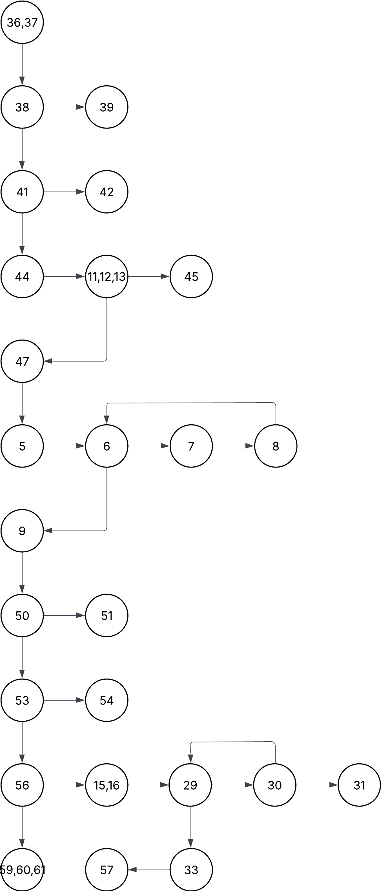

## Class Equivalence Analysis

The `create_user` method accepts the following parameters:

1. e - a string with an email template
2. u - a string that represents the username
3. b - a date that represents the birth date
4. p - a string with phone number template
5. r - a string that represents a country

### Individual Parameter Equivalence Classes

### Input domain

#### Email

- **E1** = { e | e has a valid format and is unique (e.g., "john.doe@example.com") }
<!-- TODO  or is already registered -->
- **E2** = { e | e has an invalid format (e.g., "johndoeexample.com", "john.doe@com") }

#### Username

- **U1** = { u | u has a valid length (3 ≤ length ≤ 20) (e.g., "john_doe", "user123") }
- **U2** = { u | u is too short (< 3 characters, e.g., "ab") }
- **U3** = { u | u is too long (> 20 characters, e.g., "thisusernameiswaytoolong123") }

#### Birth Date

- **B1** = { b | b is in the format "YYYY-MM-DD" and is a past date (e.g., "1990-05-10") }
- **B2** = { b | b is in an incorrect format (e.g., "1990/05/10") }
- **B3** = { b | b is in the format "YYYY-MM-DD" but is a future date (e.g., "2090-05-10") }

#### Phone Number

- **P1** = { p | p has a valid format and prefix for the specified country (e.g., "+40 712345678" for Romania) }
- **P2** = { p | p has an invalid format or an incorrect prefix (e.g., "+33 712345678" when country is "Romania") }

#### Country

Let the valid set of countries be:  
{ "Romania", "USA", "UK", "France", "Germany", "Italy", "Spain", "Canada", "Australia", "India" }

- **R1** = { r | c ∈ { "Romania", "USA", "UK", "France", "Germany", "Italy", "Spain", "Canada", "Australia", "India" } }
- **R2** = { r | c ∉ { "Romania", "USA", "UK", "France", "Germany", "Italy", "Spain", "Canada", "Australia", "India" } }

---

### Output Domain

Consists of the following two attributes:

- `status` – the HTTP response code (200 = success, 400 = error)
- `msg` – a descriptive message indicating whether the operation succeeded or why it failed

These map to the following output equivalence classes:

- **O1** = { status = 200; msg contains `"User successfully created"` }
- **O2** = { status = 400; msg contains `"Invalid email"` }
- **O3** = { status = 400; msg contains `"Email already registered"` }
- **O4** = { status = 400; msg contains `"Username too short"` }
- **O5** = { status = 400; msg contains `"Username too long"` }
- **O6** = { status = 400; msg contains `"Invalid birth date format"` }
- **O7** = { status = 400; msg contains `"Birth date is in the future"` }
- **O8** = { status = 400; msg contains `"Invalid phone number"` }
- **O9** = { status = 400; msg contains `"Unsupported country"` }

### Global Equivalence Classes

We combine the individual classes to form global test cases. Denote a global class as **C\_{abcde}**, where:

- **a**: Email class (1 for E1, 2 for E2)
- **b**: Username class (1 for U1, 2 for U2, 3 for U3)
- **c**: Birth Date class (1 for B1, 2 for B2, 3 for B3)
- **d**: Phone Number class (1 for P1, 2 for P2)
- **e**: Country class (1 for R1, 2 for R2)

Key examples include:

1. **C_11111** = { (e, u, b, p, r) | e ∈ E1, u ∈ U1, b ∈ B1, p ∈ P1, r ∈ R1 }  
   _All parameters valid (happy path)._

2. **C_12111** = { (e, u, b, p, r) | e ∈ E1, u ∈ U2, b ∈ B1, p ∈ P1, r ∈ R1 }  
   _Invalid: Username is too short._

3. **C_13111** = { (e, u, b, p, r) | e ∈ E1, u ∈ U3, b ∈ B1, p ∈ P1, r ∈ R1 }  
   _Invalid: Username is too long._

4. **C_11211** = { (e, u, b, p, r) | e ∈ E1, u ∈ U1, b ∈ B2, p ∈ P1, r ∈ R1 }  
   _Invalid: Birth Date format is incorrect._

5. **C_11311** = { (e, u, b, p, r) | e ∈ E1, u ∈ U1, b ∈ B3, p ∈ P1, r ∈ R1 }  
   _Invalid: Birth Date is in the future._

6. **C_11121** = { (e, u, b, p, r) | e ∈ E1, u ∈ U1, b ∈ B1, p ∈ P2, r ∈ R1 }  
   _Invalid: Phone Number is invalid._

7. **C_11112** = { (e, u, b, p, r) | e ∈ E1, u ∈ U1, b ∈ B1, p ∈ P1, r ∈ R2 }  
   _Invalid: Country is not in the valid list._

8. **C_21111** = { (e, u, b, p, r) | e ∈ E2, u ∈ U1, b ∈ B1, p ∈ P1, r ∈ R1 }  
   _Invalid: Email is invalid or duplicated._

---

- **c_11111** ∈ C_11111:  
  ("john.doe@example.com", "john_doe", "1990-05-10", "+40 712345678", "Romania")

- **c_12111** ∈ C_12111:  
  ("john.doe@example.com", "ab", "1990-05-10", "+40 712345678", "Romania")

- **c_13111** ∈ C_13111:  
  ("john.doe@example.com", "thisusernameiswaytoolong123", "1990-05-10", "+40 712345678", "Romania")

- **c_11211** ∈ C_11211:  
  ("john.doe@example.com", "john_doe", "1990/05/10", "+40 712345678", "Romania")

- **c_11311** ∈ C_11311:  
  ("john.doe@example.com", "john_doe", "2090-05-10", "+40 712345678", "Romania")

- **c_11121** ∈ C_11121:  
  ("john.doe@example.com", "john_doe", "1990-05-10", "+33 712345678", "Romania")

- **c_11112** ∈ C*11112:  
  ("john.doe@example.com", "john_doe", "1990-05-10", "+40 712345678", "Mars")  
  *(Invalid country example)\_

- **c_21111** ∈ C_21111:  
  ("johndoeexample.com", "john_doe", "1990-05-10", "+40 712345678", "Romania")

| Test    | Email                | Username                    | Birthdate  | Phone         | Country | Expected Output                    |
| ------- | -------------------- | --------------------------- | ---------- | ------------- | ------- | ---------------------------------- |
| C_11111 | john.doe@example.com | john_doe                    | 1990-05-10 | +40 712345678 | Romania | 200, “User successfully created”   |
| C_12111 | john.doe@example.com | ab                          | 1990-05-10 | +40 712345678 | Romania | 400, “Username too short”          |
| C_13111 | john.doe@example.com | thisusernameiswaytoolong123 | 1990-05-10 | +40 712345678 | Romania | 400, “Username too long”           |
| C_11211 | john.doe@example.com | john_doe                    | 1990/05/10 | +40 712345678 | Romania | 400, “Invalid birth date format”   |
| C_11311 | john.doe@example.com | john_doe                    | 2090-05-10 | +40 712345678 | Romania | 400, “Birth date is in the future” |
| C_11121 | john.doe@example.com | john_doe                    | 1990-05-10 | +33 712345678 | Romania | 400, “Invalid phone number”        |
| C_11112 | john.doe@example.com | john_doe                    | 1990-05-10 | +40 712345678 | Mars    | 400, “Unsupported country”         |
| C_21111 | johndoeexample.com   | john_doe                    | 1990-05-10 | +40 712345678 | Romania | 400, “Invalid email”               |

```python
    @pytest.mark.parametrize(
        "email, username, birth_date_str, phone_number, country, expected_status, expected_msg_fragment",
        [
            # C_11111: All parameters valid (E1, U1, B1, P1, R1)
            ("john.doe@example.com", "john_doe", "1990-05-10", "+40 712345678", "Romania", 200, "User successfully created"),
            # C_21111: Invalid email (E2)
            ("johndoeexample.com", "john_doe", "1990-05-10", "+40 712345678", "Romania", 400, "Invalid email"),
            # C_12111: Username too short (U2)
            ("jane.doe@example.com", "ab", "1990-05-10", "+40 712345678", "Romania", 400, "Username too short"),
            # C_13111: Username too long (U3)
            ("jane.doe2@example.com", "a" * 21, "1990-05-10", "+40 712345678", "Romania", 400, "Username too long"),
            # C_11211: Birth date in incorrect format (B2)
            ("jack.doe@example.com", "jack_doe", "1990/05/10", "+40 712345678", "Romania", 400, "Invalid birth date"),
            # C_11311: Birth date in future (B3)
            ("future.doe@example.com", "future_user", "2090-05-10", "+40 712345678", "Romania", 400, "Birth date is in the future"),
            # C_11121: Invalid phone number (P2)
            ("phone.doe@example.com", "phone_user", "1990-05-10", "+33 712345678", "Romania", 400, "Phone number prefix does not match the country"),
            # C_11112: Invalid country (R2)
            # as it will not have a prefix
            ("country.doe@example.com", "country_user", "1990-05-10", "+40 712345678", "Mars", 400, "Phone number prefix does not match the country"),
        ]
    )
    def test_equivalence_classes(self, email, username, birth_date_str, phone_number, country, expected_status, expected_msg_fragment):
        status, msg = self.um.create_user(
            email=email,
            username=username,
            birth_date_str=birth_date_str,
            phone_number=phone_number,
            country=country
        )
        assert status == expected_status
        assert expected_msg_fragment in msg
```

## Boundary Value Analysis

In our case, we applied Boundary Value Analysis to the `UserManager` class to ensure that edge cases related to user creation were properly handled. The key boundary conditions we tested include:

1. **Username Length**

   - Minimum invalid: `aaa` (3 characters) → Expected failure
   - Minimum valid: `aaaa` (4 characters) → Expected success
   - Maximum valid: `a` \* 19 (19 characters) → Expected success
   - Maximum invalid: `a` \* 20 (20 characters) → Expected failure

2. **Birth Date**

   - Future date (today’s date) → Expected failure
   - Oldest valid date (`1900-01-01`) → Expected success

3. **Email Format**

   - Minimal valid email format (`a@b.c`) → Expected success

4. **Phone Number Prefix Matching**
   - Valid country prefix (`+1` for USA when the country is "USA") → Expected success
   - Invalid prefix (`+1` for Romania when the expected prefix is `+40`) → Expected failure

These tests ensure that `UserManager` correctly validates user inputs at the boundaries of acceptable values.

### Running the Tests and Coverage Analysis

We executed the boundary tests using the following command:

```sh
pytest --cov=src --cov-report=term-missing test/test_boundary.py
```

The results were as follows:

```plaintext
Name                 Stmts   Miss  Cover   Missing
--------------------------------------------------
src\User.py              7      0   100%
src\UserManager.py      40      7    82%   12-13, 38, 43-44, 50, 53
src\__init__.py          0      0   100%
--------------------------------------------------
TOTAL                   47      7    85%
```

### Why 100% Coverage Isn't Necessary

The reported 82% coverage for UserManager.py indicates that some lines are not executed by our boundary tests. However, this does not mean that our boundary testing is incomplete. The missing lines are not related to boundary conditions.

Since our goal was to validate boundary conditions, achieving 100% coverage is not strictly necessary. Instead, our focus is on ensuring that key input constraints are thoroughly tested, which our boundary tests accomplish effectively.

We validated that extreme and edge-case inputs are properly handled. Although we achieved 82% coverage, our tests sufficiently address critical boundary conditions, ensuring robust user validation.

---

## Statement Analysis

We applied Statement analisys on the `UserManager` class with a 98% statement coverage. The following Control Flow Graph has been created:
[Lucid Chart](https://lucid.app/lucidchart/52e5e0a2-3c17-4dda-8930-4ef34498d4b7/edit?invitationId=inv_e62830fb-62b8-4810-9e4c-0ee0b0dc8ec7)




